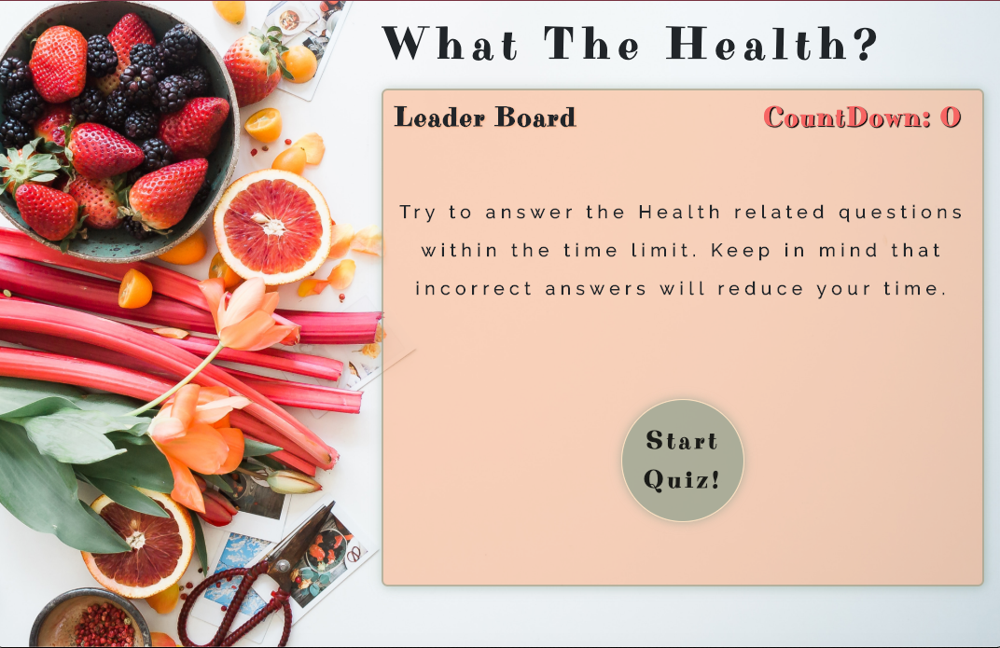

# health-quiz
A multiple choice health quiz that will be timed response and provide an answer after users guess with a collection of correct answers. 


### Prerequisites

Applied Bootstap CDN for responsivness 

```
<link rel="stylesheet" href="https://stackpath.bootstrapcdn.com/bootstrap/4.3.1/css/bootstrap.min.css" integrity="sha384-ggOyR0iXCbMQv3Xipma34MD+dH/1fQ784/j6cY/iJTQUOhcWr7x9JvoRxT2MZw1T" crossorigin="anonymous">
```

Applied animate.css cdn for some animations

```
<link rel="stylesheet" href="https://cdnjs.cloudflare.com/ajax/libs/animate.css/3.7.2/animate.min.css">

```

## Built With

* [Animate.CSS](https://github.com/daneden/animate.css) CSS animations
* [BootStrap](https://getbootstrap.com/) - BootStrap CDN
* [FONTS](https://fonts.google.com/) - Used to generate RSS Feeds
* JavaScript
* Web API's


## Authors

* **Stephen Webb** - *Initial Work* - [Health Quiz](https://stevie2codes.github.io/health-quiz/)


## Acknowledgments

* BackGround Photo by Brooke Lark on Unsplash
* Project guidlines provided by Vanderbilt bootcamp


## What I learned 

I of course had fun with the CSS on this project, learning new animations. 
I had several hurdles to jump over to get through this project. Carrying functions into functions was an AHA moment for me. Using Web API's 
like setInterval() was alot of fun to use. I feel naming variables is becoming more second nature and allows me to remeber functions in the program. Using local storage in this project was the hardest thing for me to get functional. I look forward to applying it to future projects to overcome any weak spots. 

